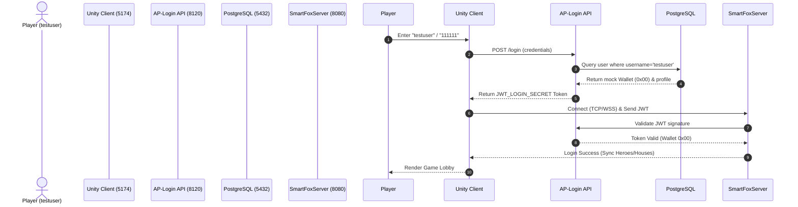

# 🚀 Bomb Crypto V2 - Hub Megazord 🚀

[](https://www.docker.com/)
[](https://nodejs.org/)
[](https://www.postgresql.org/)
[](https://unity.com/)

## 📖 The "Why"

Welcome to the **Hub Megazord**, the centralized orchestration repository for the Bomb Crypto V2 ecosystem. This Hub transforms complex microservices and disparate sub-repositories into a **World-Class Open Source Infrastructure**.

**Our Philosophy**: No "black boxes." Everything must be documented. The sub-repositories remain untouchable, and all orchestration intelligence resides right here in the Root (Hub).

---

## ⚡ Quick Start

Booting the entire ecosystem is just one command away:

**Para Mac/Linux:**
```bash
./scripts/start-megazord.sh
```

**Para Windows:**
```cmd
.\scripts\start-megazord.bat
```

> **Note (Pre-Flight Git Sync):** The boot scripts now include an automatic "Pre-Flight Git Sync" step. This ensures that your sub-repositories (`client`, `server`, `market`) are always pulled and updated to the latest main branch before the ecosystem boots up, guaranteeing you are running the most current code. If a sync fails due to local changes, you will be prompted to either abort or continue with your local modifications.

**Access Points:**
- **🎮 Unity WebGL Client:** [http://localhost:5174](http://localhost:5174)
- **🌐 Marketplace Frontend:** [http://localhost:5173](http://localhost:5173)

For detailed local play instructions, refer to `docs/COMO_JOGAR_LOCAL.md` or `docs/local-megazord-setup.md`.

---

## 📂 Hub Architecture

```text
/bomb (Root)
├── /scripts
│   ├── start-megazord.sh / .bat
│   ├── doctor-megazord.sh / .bat
│   ├── clean-megazord.sh / .bat
│   └── ...
├── /docs
│   ├── SYSTEM_ATLAS.md
│   └── ...
├── /audits
│   ├── /infra
│   ├── /security
│   ├── /contracts
│   └── /gameplay
├── /archive
├── bombcrypto-client-v2/ (Submodule)
├── bombcrypto-server-v2/ (Submodule)
└── bombcrypto-market-v2/ (Submodule)
```

---

## 🏗️ Architecture Map (C4 Model)

```mermaid
C4Context
    title System Context diagram for Bomb Crypto V2 Ecosystem

    Person(player, "Player", "A user of the Bomb Crypto V2 Game.")

    System(unity_client, "Unity WebGL Client", "The game client running in the browser. Port: 5174")
    System(market_frontend, "Market Frontend", "The marketplace UI for trading assets. Port: 5173")

    SystemDb(postgres, "PostgreSQL Database", "Stores user data, game state, and marketplace listings. Port: 5432")
    SystemDb(redis, "Redis Cache", "Handles session caching and fast messaging. Port: 6379")

    System(smartfox, "SmartFoxServer", "Real-time multiplayer game server. Ports: 8080/8443/9933")
    System(ap_login, "AP-Login API", "Handles user authentication. Port: 8120")
    System(market_api, "Market API", "Handles marketplace transactions. Port: 3000")

    SystemExt(hardhat, "Hardhat Local Node", "Simulated Ethereum/BSC blockchain for local testing. Port: 8545")

    Rel(player, unity_client, "Plays game using", "HTTPS/WSS")
    Rel(player, market_frontend, "Trades NFTs using", "HTTPS")

    Rel(unity_client, ap_login, "Authenticates via", "REST API")
    Rel(unity_client, smartfox, "Syncs real-time state via", "TCP/WSS")

    Rel(market_frontend, market_api, "Makes API calls to", "REST API")
    Rel(market_frontend, hardhat, "Connects Web3 wallet to", "RPC")

    Rel(ap_login, postgres, "Reads/Writes user data to", "JDBC")
    Rel(smartfox, postgres, "Reads/Writes game state to", "JDBC")
    Rel(market_api, postgres, "Reads/Writes market data to", "JDBC")

    Rel(ap_login, redis, "Caches sessions in", "Redis Protocol")
    Rel(smartfox, redis, "Caches state in", "Redis Protocol")
    Rel(market_api, redis, "Caches market listings in", "Redis Protocol")
```

---

## 🔐 First User Login Sequence

To help new developers understand the "Magic Flow", here is the sequence of events when a local `testuser` (Wallet `0x00`) logs into the client.



---

## 🛠️ The Survival Kit

Need to diagnose or clean the environment? Use the Hub's built-in tools:

- `./scripts/doctor-megazord.sh`: Runs a health diagnostic on your Docker daemon, checks if all required ports are free, and lists running containers.
- `./scripts/clean-megazord.sh`: The **Terra Arrasada** protocol. Stops all containers, wipes the databases/volumes, and kills any zombie Vite or Node processes lingering on ports `5173` or `5174`.

## 📚 Knowledge Base

- [docs/SYSTEM_ATLAS.md](docs/SYSTEM_ATLAS.md) - The complete inventory of DB tables, API endpoints, and Magic Numbers.
- [CONTRIBUTING.md](CONTRIBUTING.md) - The developer manifesto and Sub-Repository isolation rules.
- [audits/infra/journal.md](audits/infra/journal.md) - Technical risks and observations log.
